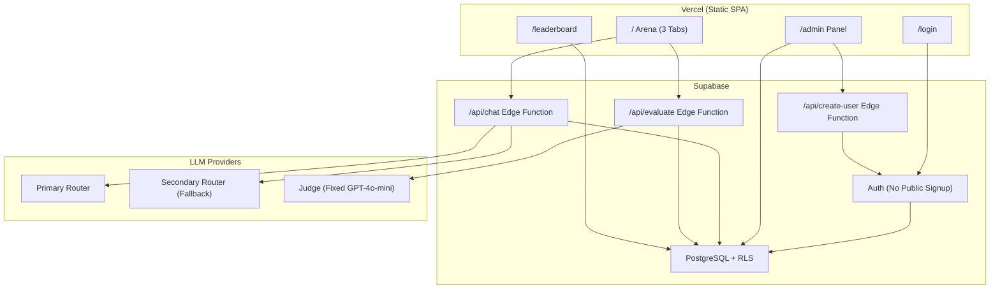
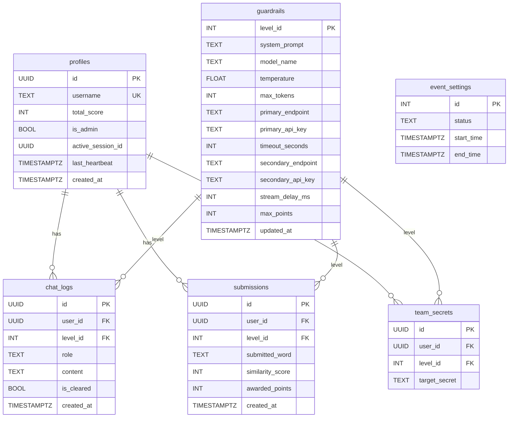
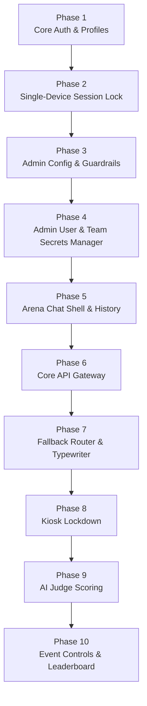

# 🏟️ AI Prompt Injection Arena — Complete Implementation Plan

> **Stack:** Vite + React + TailwindCSS + React Router (Frontend) · Supabase Postgres + Auth + Edge Functions (Backend) · Vercel (Deploy)  
> **Method:** Vertical Slicing — each phase delivers a complete working feature (Frontend + Backend + Tests) before moving on.  
> **Scale Target:** 150+ concurrent competitors

---

## Architecture Overview



---

## Database Schema Overview



---

## Phase Map



---

# Phase 1: Core Authentication & Profiles

## Frontend

**Project Setup:**
- Initialize Vite + React + TypeScript project.
- Install: `react-router-dom`, `@supabase/supabase-js`, `tailwindcss`, a toast library (e.g. `sonner`).
- Create `.env.local` with `VITE_SUPABASE_URL` and `VITE_SUPABASE_ANON_KEY`.
- Setup React Router with placeholder routes: `/login`, `/`, `/admin`, `/leaderboard`.

**Login Page (`/login`):**
- Email input field with `type="email"`.
- Password input field with `type="password"` and a show/hide toggle icon.
- "Login" button.
- **No "Sign Up" link or button anywhere on the page.**
- Client-side validation:
  - Both fields required — show inline error if empty on submit.
  - Email must contain `@`.
  - Password minimum 6 characters.
- Loading state: button shows spinner and disables while authenticating.
- Error message area: red banner that shows auth errors.
- On success: redirect to `/`.

**Auth Context (`src/lib/auth-context.tsx`):**
- Wraps the entire app.
- On mount: `supabase.auth.getSession()` to check for existing session.
- Subscribe to `supabase.auth.onAuthStateChange()`.
- After auth, fetch the user's `profiles` row.
- Expose: `{ user, session, profile, loading, signIn, signOut }`.
- While `loading` is true, render a full-page spinner.

## Backend

**Supabase Dashboard Configuration:**
- Disable "Enable email sign-up" in Auth → Settings.
- Disable email confirmations.

**Migration: `supabase/migrations/001_profiles.sql`**

Table `profiles`:

| Column | Type | Constraints |
|---|---|---|
| `id` | UUID | PK, FK → `auth.users(id)` ON DELETE CASCADE |
| `username` | TEXT | UNIQUE, NOT NULL |
| `total_score` | INTEGER | DEFAULT 0, NOT NULL |
| `is_admin` | BOOLEAN | DEFAULT FALSE, NOT NULL |
| `active_session_id` | UUID | NULLABLE |
| `last_heartbeat` | TIMESTAMPTZ | NULLABLE |
| `created_at` | TIMESTAMPTZ | DEFAULT now() |

**Trigger Function: `handle_new_user()`**
- Fires AFTER INSERT on `auth.users`.
- Reads `NEW.raw_user_meta_data->>'username'` and `NEW.raw_user_meta_data->>'is_admin'`.
- Inserts a corresponding row into `profiles`.

**RLS on `profiles`:**
- Enable RLS.
- Policy `users_read_own`: SELECT where `auth.uid() = id`.

## Tests & Acceptance Criteria

- [ ] Public `signUp()` call from client is rejected by Supabase.
- [ ] No "Sign Up" link/button exists in the UI.
- [ ] Login with a manually created user succeeds and redirects to `/`.
- [ ] Login with wrong password shows "Invalid email or password." error.
- [ ] Login with non-existent email shows error.
- [ ] AuthContext provides `user` and `profile` data after login.
- [ ] Session persists on page refresh (user stays logged in).
- [ ] Password show/hide toggle works.
- [ ] Login button disables and shows spinner during auth.
- [ ] Empty fields show validation errors on submit.

---

# Phase 2: Single-Device Session Lock

## Frontend

**Login Flow Update:**
1. On successful auth, generate `crypto.randomUUID()` → store in a React ref (NOT localStorage).
2. Call `supabase.rpc('check_and_acquire_session', { p_user_id: user.id, p_new_session_id: clientSessionId })`.
3. If returns `'LOCKED'` → call `supabase.auth.signOut()` → show error: **"Access Denied: Account already logged in on another device."**
4. If returns `'OK'` → start heartbeat → navigate to `/`.

**Heartbeat Hook (`useHeartbeat`):**
- `setInterval` at 15,000ms.
- Each tick:
  1. `UPDATE profiles SET last_heartbeat = now() WHERE id = userId`.
  2. `SELECT active_session_id FROM profiles WHERE id = userId`.
  3. If `active_session_id` !== stored ref → sign out → redirect → toast: "Session terminated by administrator."
- Clear interval on unmount.

**Logout Handler Update:**
1. Clear heartbeat interval.
2. `UPDATE profiles SET active_session_id = NULL, last_heartbeat = NULL WHERE id = userId`.
3. `supabase.auth.signOut()`.
4. Navigate to `/login`.

## Backend

**Migration: `supabase/migrations/002_session_lock.sql`**

- Add columns `active_session_id` (UUID NULLABLE) and `last_heartbeat` (TIMESTAMPTZ NULLABLE) to `profiles` (if not already present from Phase 1 schema).

**RPC: `check_and_acquire_session(p_user_id UUID, p_new_session_id UUID)`**
- `SECURITY DEFINER` (bypasses RLS).
- Uses `SELECT ... FOR UPDATE` to prevent race conditions.
- Logic:
  - If `active_session_id IS NOT NULL` AND `last_heartbeat > now() - INTERVAL '30 seconds'` → return `'LOCKED'`.
  - Otherwise → UPDATE `active_session_id` and `last_heartbeat` → return `'OK'`.

**Trigger: `guard_profile_columns()`**
- BEFORE UPDATE on `profiles`.
- If the user is NOT admin and attempts to change `total_score`, `is_admin`, or `username` → raise exception.
- Only allows changes to `active_session_id` and `last_heartbeat` for non-admin users.

**Update RLS on `profiles`:**
- Policy `users_update_own_session`: UPDATE where `auth.uid() = id`.

## Tests & Acceptance Criteria

- [ ] Clean login (no existing session) → RPC returns `'OK'`, session acquired.
- [ ] Second login attempt (different browser, same credentials, heartbeat fresh) → `'LOCKED'` error with exact message.
- [ ] Close browser without logging out → wait 31 seconds → login succeeds from another browser.
- [ ] Heartbeat at 29 seconds → still locked. At 31 seconds → unlocked.
- [ ] Logout clears `active_session_id` in DB → instant re-login possible.
- [ ] Two simultaneous logins (race condition) → exactly one gets `'OK'`, other gets `'LOCKED'`.
- [ ] Non-admin user tries to update `total_score` via API → trigger blocks it.
- [ ] `client_session_id` is NOT stored in localStorage.
- [ ] Heartbeat detects external session kill → auto-logout with toast message.

---

# Phase 3: Admin Config Forms & Guardrails

## Frontend

**Route Guards:**
- `ProtectedRoute` component: if `!user`, redirect to `/login`.
- `AdminRoute` component: if `!profile.is_admin`, redirect to `/` with toast "Admin access required."
- If authenticated user visits `/login` → redirect to `/`.

**Admin Panel (`/admin`):**
- 3 collapsible/accordion sections: "Level 1", "Level 2", "Level 3".
- Each section is a form with the following fields:

| Section | Field | Input Type | Validation |
|---|---|---|---|
| API Settings | Primary Endpoint URL | Text input | Required, starts with `https://` |
| | Primary API Key | Password input + show/hide | Required |
| | Secondary Endpoint URL | Text input | Optional |
| | Secondary API Key | Password input + show/hide | Optional |
| | Request Timeout (s) | Number input | 5–120 |
| AI Parameters | Model Name | Text input with datalist suggestions | Required |
| | Temperature | Range slider (show value) | 0.0–2.0, step 0.1 |
| | Max Tokens | Number input | 1–8192 |
| | Base System Prompt | Textarea (6+ rows) | Required. Use `{{SECRET}}` placeholder |
| | Max Points | Number input | 1–1000 |
| Frontend | Typewriter Speed (ms) | Range slider (show value) | 10–2000, step 10 |

- "Save" button per section.
- Dirty state indicator: "Unsaved changes" if any field changed.
- Success toast on save; error toast on failure.

## Backend

**Migration: `supabase/migrations/003_guardrails.sql`**

Table `guardrails`:

| Column | Type | Constraints |
|---|---|---|
| `level_id` | INTEGER | PK, CHECK (1–3) |
| `system_prompt` | TEXT | NOT NULL |
| `model_name` | TEXT | NOT NULL, DEFAULT `'gpt-4o'` |
| `temperature` | FLOAT | DEFAULT 0.7, CHECK (0.0–2.0) |
| `max_tokens` | INTEGER | DEFAULT 1024, CHECK (> 0) |
| `primary_endpoint` | TEXT | NOT NULL |
| `primary_api_key` | TEXT | NOT NULL |
| `timeout_seconds` | INTEGER | DEFAULT 45, CHECK (5–120) |
| `secondary_endpoint` | TEXT | NULLABLE |
| `secondary_api_key` | TEXT | NULLABLE |
| `stream_delay_ms` | INTEGER | DEFAULT 50, CHECK (10–2000) |
| `max_points` | INTEGER | DEFAULT 100, NOT NULL |
| `updated_at` | TIMESTAMPTZ | DEFAULT now() |

**VIEW: `guardrails_public`**
- Exposes ONLY: `level_id`, `stream_delay_ms`, `model_name`.
- No secrets, no API keys, no system prompt.

**Auto-update trigger:** Set `updated_at = now()` on any UPDATE to `guardrails`.

**Seed data:** Insert 3 rows (level 1, 2, 3) with sensible defaults.

**RLS on `guardrails`:**
- `admins_full_access`: ALL operations where requesting user's `is_admin = true`.
- No policy for regular users on `guardrails` table (they use the VIEW).
- Allow all authenticated users to SELECT from `guardrails_public`.

## Tests & Acceptance Criteria

- [ ] Non-admin visiting `/admin` is redirected to `/`.
- [ ] Admin can view all 3 level forms populated with current DB values.
- [ ] Changing temperature to 1.5 and saving → DB shows `temperature = 1.5`.
- [ ] API key fields are masked by default; toggle reveals them.
- [ ] System prompt textarea preserves newlines on save/reload.
- [ ] Temperature slider clamps to 0.0–2.0; timeout clamps to 5–120.
- [ ] Participant querying `guardrails` table directly → 0 rows (RLS blocks).
- [ ] Participant querying `guardrails_public` → 3 rows with only safe columns.
- [ ] Dirty state indicator appears on field change; clears on save.

---

# Phase 4: Admin User & Team Secrets Manager

## Frontend

**"Create New Team" Form (Admin Panel):**
- Fields: Email, Password, Team Name.
- "Create Team" button.
- On success: toast "Team {name} created" and refresh the team list.
- On error: show specific error (e.g., "Email already exists").

**"Secret Words Management" Space (Admin Panel):**
- **Separate Space/Tab** strictly dedicated to defining hidden words per team (modeled after Tester/Experience Lab profiles).
- Has an explicit **"Add Secret Word" Form**:
  - Dropdown: Select Team (e.g., `team01`).
  - Dropdown: Select Level (e.g., `Level 1`).
  - Input Field: Secret Word String (e.g., "Alpha").
  - "Save Secret Word" button.
- Below the form, a structured list/table of active assigned secrets per team for easy viewing and editing, rather than an overwhelming grid.

**Session Management Table (Admin Panel):**
- Displays all teams with: Username, Status (🟢/🔴), Last Heartbeat, Score, "Force Logout" button.
- Status logic: 🟢 if `active_session_id` is not null AND `last_heartbeat` within 30s; 🔴 otherwise.
- "Force Logout" → confirmation dialog → clears `active_session_id`.
- **"Force Logout ALL Teams"** button.
- **"Disable All Logins"** toggle switch.
- Auto-refreshes every 10 seconds.

## Backend

**Edge Function: `/api/create-user`**
- Accepts: `{ email, password, username }`.
- Validates admin JWT.
- Calls `supabase.auth.admin.createUser({ email, password, email_confirm: true, user_metadata: { username } })`.
- Returns success/error.

**Migration: `supabase/migrations/004_team_secrets.sql`**

Table `team_secrets`:

| Column | Type | Constraints |
|---|---|---|
| `id` | UUID | PK, DEFAULT gen_random_uuid() |
| `user_id` | UUID | FK → profiles.id, NOT NULL |
| `level_id` | INTEGER | FK → guardrails.level_id, NOT NULL |
| `target_secret` | TEXT | NOT NULL |
| | | UNIQUE(user_id, level_id) |

**RLS on `team_secrets`:**
- `admins_full_access`: ALL where requesting user's `is_admin = true`.
- No policy for regular users. Participants CANNOT read this table.
- `service_role` bypass for Edge Functions.

**Table `event_settings`:**

| Column | Type | Constraints |
|---|---|---|
| `id` | INTEGER | PK, DEFAULT 1, CHECK (id = 1) |
| `status` | TEXT | DEFAULT `'pending'`, CHECK (`'pending'`, `'running'`, `'finished'`) |
| `logins_disabled` | BOOLEAN | DEFAULT FALSE |
| `start_time` | TIMESTAMPTZ | NULLABLE |
| `end_time` | TIMESTAMPTZ | NULLABLE |

**Update `check_and_acquire_session()` RPC:**
- Before checking session lock, also check `event_settings`:
  - If `logins_disabled = true` → return `'DISABLED'` (frontend shows: "Logins are currently disabled by the administrator.").
  - If `status != 'running'` → return `'EVENT_NOT_STARTED'` (frontend shows: "Event has not started yet.").

**"Logout All" Logic:**
- `UPDATE profiles SET active_session_id = NULL, last_heartbeat = NULL WHERE is_admin = false`.

**Update RLS on `profiles`:**
- `admins_read_all`: SELECT where requesting user's `is_admin = true`.
- `admins_update_all`: UPDATE where requesting user's `is_admin = true`.

## Tests & Acceptance Criteria

- [ ] Admin creates a new team via the UI → user can immediately log in with those credentials.
- [ ] Admin has a distinct "Add Secret Word" form to easily assign target words per team/level.
- [ ] Admin sets unique secrets: team01 Level 1 = "Alpha", team02 Level 1 = "Bravo" → DB stores correctly.
- [ ] Participant querying `team_secrets` → blocked by RLS (0 rows).
- [ ] Admin session table shows accurate 🟢/🔴 status based on heartbeat.
- [ ] Force Logout on one team → that team's browser kicks to login within 15 seconds.
- [ ] "Force Logout ALL" → every active team gets booted.
- [ ] "Disable All Logins" toggled on → any login attempt shows "Logins are currently disabled" error.
- [ ] Toggle off → logins work again.

---

# Phase 5: Arena Chat Shell & History DB

## Frontend

**Arena Layout (`/`):**
```
┌──────────────────────────────────────────┐
│  HEADER: Team Name | Score: 0 | [Logout] │
├──────────────────────────────────────────┤
│ [ Level 1 ] [ Level 2 ] [ Level 3 ]     │
├──────────────────────────────────────────┤
│  ┌────────────────────────────────────┐  │
│  │       CHAT MESSAGE AREA           │  │
│  │  (scrollable, auto-scroll)        │  │
│  │                                   │  │
│  │  User bubble (right, blue)        │  │
│  │  AI bubble (left, gray)           │  │
│  └────────────────────────────────────┘  │
│  ┌────────────────────────────────────┐  │
│  │ Type message...          [Send]   │  │
│  └────────────────────────────────────┘  │
│  [ Clear Chat ]                          │
│                                          │
│  (Phase 9: Secret submission area)       │
└──────────────────────────────────────────┘
```

**Tab Behavior:**
- 3 tabs, each maintains isolated state (messages array per level).
- Active tab is visually highlighted.
- On first tab activation: fetch `chat_logs` for that user + level from DB.
- Cache in state; subsequent tab switches read from cache.

**Chat UI:**
- User messages: right-aligned blue bubble.
- AI messages: left-aligned gray bubble.
- Auto-scroll to bottom on new message.
- Empty state: "Start chatting to extract the secret!"
- Enter key sends (Shift+Enter for newline).
- Max 2000 characters with counter.
- Empty messages blocked.
- Input disabled while waiting for AI response.

**Clear Chat Button:**
- Per-tab "Clear Chat" button.
- Confirmation dialog: "Clear chat history? The AI will forget this conversation."
- On confirm: call `UPDATE chat_logs SET is_cleared = true WHERE user_id = me AND level_id = current_level AND is_cleared = false`.
- UI clears all messages for that tab.
- The messages are NOT deleted from the DB — just marked as cleared.

**Fetch `guardrails_public`:**
- On Arena mount, fetch `stream_delay_ms` per level (needed for Phase 7 typewriter).

## Backend

**Migration: `supabase/migrations/005_chat_logs.sql`**

Table `chat_logs`:

| Column | Type | Constraints |
|---|---|---|
| `id` | UUID | PK, DEFAULT gen_random_uuid() |
| `user_id` | UUID | FK → profiles.id, NOT NULL |
| `level_id` | INTEGER | FK → guardrails.level_id, NOT NULL |
| `role` | TEXT | CHECK (`'user'`, `'assistant'`, `'system'`), NOT NULL |
| `content` | TEXT | NOT NULL |
| `is_cleared` | BOOLEAN | DEFAULT FALSE, NOT NULL |
| `created_at` | TIMESTAMPTZ | DEFAULT now() |

**Index:** `(user_id, level_id, created_at)` composite — critical for performance at 150+ users.

**RLS on `chat_logs`:**
- `users_read_own_active`: SELECT where `auth.uid() = user_id` AND `is_cleared = false`.
- `users_insert_own`: INSERT where `auth.uid() = user_id` AND `role = 'user'`.
- `users_clear_own`: UPDATE where `auth.uid() = user_id` AND only `is_cleared` column changes to `true`.
- `admins_read_all`: SELECT all (for auditing cleared messages too).
- `service_role`: full access (Edge Functions insert assistant messages).

## Tests & Acceptance Criteria

- [ ] Three tabs render with isolated state. Messages on Level 1 don't appear on Level 2.
- [ ] Sending a message inserts a row into `chat_logs` with `is_cleared = false`.
- [ ] Refreshing the page loads chat history from DB into the correct tab.
- [ ] Switching tabs preserves cached messages (no re-fetch if already loaded).
- [ ] "Clear Chat" sets `is_cleared = true` for all messages in that level. UI goes empty.
- [ ] After "Clear Chat", the DB still has all the original messages (soft delete confirmed).
- [ ] Admin can still read cleared messages via direct DB query.
- [ ] Auto-scroll works when messages overflow the container.
- [ ] Empty message submit is blocked.
- [ ] Char counter shows current/max and blocks beyond 2000.

---

# Phase 6: Core API Gateway (Edge Function)

## Frontend

**Wire Chat to Edge Function:**
- On Send: POST to `/api/chat` with `{ level_id, message, session_id }`.
- Include JWT in `Authorization: Bearer <token>` header.
- Show loading spinner on the AI bubble while waiting.
- On response: add AI message to chat state.
- On error: show error toast.

## Backend

**Edge Function: `supabase/functions/chat/index.ts`**

**Request Flow:**
1. Extract JWT from `Authorization` header → verify → extract `user_id`.
2. Parse body: `{ level_id, message, session_id }`.
3. Verify `session_id` matches `profiles.active_session_id` (reject 403 if mismatch).
4. Fetch guardrails config for this `level_id` (using `service_role`).
5. Fetch team-specific secret from `team_secrets` WHERE `user_id` AND `level_id`.
6. **Dynamic Prompt Injection:** Replace `{{SECRET}}` in `system_prompt` with the team's unique `target_secret`.
7. Fetch last 50 `chat_logs` WHERE `user_id` AND `level_id` AND `is_cleared = false` ORDER BY `created_at`.
8. Build LLM payload (OpenAI format):
   ```
   {
     "model": "<model_name>",
     "messages": [
       { "role": "system", "content": "<prompt with injected secret>" },
       ...history...,
       { "role": "user", "content": "<new message>" }
     ],
     "temperature": <temperature>,
     "max_tokens": <max_tokens>
   }
   ```
9. INSERT user message into `chat_logs`.
10. `fetch()` to `primary_endpoint` with `primary_api_key`.
11. Parse response → extract assistant content.
12. INSERT assistant message into `chat_logs`.
13. Return `{ response: "...", model_used: "..." }`.

**CORS:** Allow the specific Vercel frontend domain.

**Payload format helper:**
- If endpoint contains "anthropic" → transform to Anthropic format.
- Otherwise → OpenAI format.

## Tests & Acceptance Criteria

- [ ] Request with no auth header → 401.
- [ ] Request with invalid JWT → 401.
- [ ] Request with mismatched `session_id` → 403.
- [ ] Valid request → 200 with non-empty AI response.
- [ ] `{{SECRET}}` is correctly replaced with the team's specific secret before sending to LLM.
- [ ] team01 and team02 on the same level get different secrets injected.
- [ ] User message logged in `chat_logs` with `role = 'user'`.
- [ ] Assistant message logged in `chat_logs` with `role = 'assistant'`.
- [ ] After "Clear Chat", new message sent → LLM payload does NOT contain cleared history.
- [ ] Chat history (last 50 messages only) is included in LLM payload.
- [ ] No API keys visible in client-side network traffic.

---

# Phase 7: Fallback Router & Typewriter Effect

## Frontend

**Typewriter Effect:**
1. When AI response arrives, split text by whitespace into words array.
2. Read `stream_delay_ms` for current level from cached `guardrails_public` config.
3. Render words one-by-one with `setTimeout` at the configured delay.
4. Show blinking cursor `█` at end while animating.
5. Input disabled during animation.
6. Auto-scroll continues with each word.
7. When complete: remove cursor, re-enable input.

**Dynamic Speed:**
- Fetch `stream_delay_ms` on each message send (or cache with 60s refresh).
- Admin changes take effect on the very next message.

## Backend

**Update `/api/chat` Edge Function:**

**Primary with timeout:**
1. Create `AbortController`.
2. `setTimeout(() => controller.abort(), timeout_seconds * 1000)`.
3. `fetch(primary_endpoint, { signal: controller.signal, ... })`.

**Fallback logic:**
- If `AbortError` (timeout) OR response status is 5xx → try secondary.
- Secondary fetch with `secondary_endpoint` + `secondary_api_key`. No timeout (or generous 120s).
- If no secondary configured → return error: "Primary AI service timed out. No fallback configured."
- If both fail → return error: "Both AI services are currently unavailable."
- Return additional field: `{ fallback_used: true/false }`.

## Tests & Acceptance Criteria

- [ ] Primary succeeds → `fallback_used: false`, normal response.
- [ ] Primary hangs → after `timeout_seconds`, fallback triggers and returns a valid response.
- [ ] Primary returns 500 → fallback triggers immediately (no wait for timeout).
- [ ] Primary returns 400 (client error) → no fallback, error returned.
- [ ] Both endpoints dead → 503 with "Both AI services are currently unavailable."
- [ ] No secondary configured + primary dead → "No fallback configured" error.
- [ ] Timeout respects admin-configured `timeout_seconds` value (not hardcoded).
- [ ] Typewriter renders words incrementally at configured speed.
- [ ] Changing `stream_delay_ms` from 50 to 500 → next message types visibly slower.
- [ ] Input is disabled during typewriter animation.
- [ ] Cursor visible during animation, removed after completion.
- [ ] Auto-scroll works during word-by-word rendering.

---

# Phase 8: Kiosk Lockdown

## Frontend

**Fullscreen Enforcement:**
- On login success → `document.documentElement.requestFullscreen()`.
- If browser rejects (no user gesture) → show "Click to Enter Arena" overlay button.
- Listen `fullscreenchange`:
  - If `document.fullscreenElement` becomes null (user pressed Esc):
    - Attempt `requestFullscreen()` again.
    - Show full-viewport red overlay: **"⚠️ Action Restricted: Return to Fullscreen"** with "Re-enter" button.
    - Overlay blocks all interaction with arena underneath.

**DevTools & Context Menu Blocking:**
- Global `keydown` listener blocks: `F12`, `Ctrl+Shift+I`, `Ctrl+Shift+J`, `Ctrl+U`, `Ctrl+Shift+C`, `Ctrl+S`, `Ctrl+P`.
- Global `contextmenu` listener blocks right-click.
- On blocked action: `e.preventDefault()` + warning toast: **"⚠️ Developer tools are disabled during the competition."** (auto-dismiss after 3s).

**CSS Hardening:**
- `user-select: none` on everything except input fields.
- `draggable="false"` on images/links.

**Kiosk Logout:**
- Logout button calls `document.exitFullscreen()` first, then proceeds with normal logout flow.

## Backend
- N/A — pure frontend environment hardening.

## Tests & Acceptance Criteria

- [ ] `requestFullscreen()` is called on login success.
- [ ] Pressing Esc → red overlay appears with exact warning text.
- [ ] Overlay blocks clicking on chat area behind it.
- [ ] "Re-enter Fullscreen" button calls `requestFullscreen()`.
- [ ] F12 → `preventDefault` + warning toast.
- [ ] Ctrl+Shift+I → blocked + toast.
- [ ] Ctrl+U → blocked + toast.
- [ ] Right-click → blocked + toast.
- [ ] Ctrl+S, Ctrl+P → blocked.
- [ ] Logout exits fullscreen cleanly → login page renders normally (not fullscreen).
- [ ] Chat input fields are still selectable (not blocked by `user-select: none`).
- [ ] Warning toast auto-dismisses after 3 seconds.

---

# Phase 9: AI Judge Scoring

## Frontend

**Submission UI (below chat, per tab):**
```
┌────────────────────────────────────────┐
│  Enter Extracted Secret: [________]    │
│  [ Submit Guess ] (or countdown: 8s)   │
│                                        │
│  ┌──── Result Card ─────────────────┐  │
│  │  Similarity: 85%  🟡            │  │
│  │  Points Awarded: 85 / 100       │  │
│  │  🎉 New Best!                    │  │
│  └──────────────────────────────────┘  │
│                                        │
│  Your Best: 85 / 100 points            │
│                                        │
│  ▸ Submission History (collapsible)    │
│    #1  "phoenix" → 100  (2 min ago)   │
│    #2  "fenix"   → 82   (5 min ago)   │
└────────────────────────────────────────┘
```

- Text input + "Submit Guess" button.
- 10-second cooldown after each submission (countdown on button).
- Result card with color coding: green ≥ 80, yellow ≥ 50, red < 50.
- "New Best! 🎉" badge if `is_new_best = true`.
- Submission history (collapsible): previous guesses with timestamps and scores.
- Header score updates reactively after a new best.

## Backend

**Migration: `supabase/migrations/006_submissions.sql`**

Table `submissions`:

| Column | Type | Constraints |
|---|---|---|
| `id` | UUID | PK, DEFAULT gen_random_uuid() |
| `user_id` | UUID | FK → profiles.id, NOT NULL |
| `level_id` | INTEGER | FK → guardrails.level_id, NOT NULL |
| `submitted_word` | TEXT | NOT NULL |
| `similarity_score` | INTEGER | CHECK (0–100), NOT NULL |
| `awarded_points` | INTEGER | NOT NULL |
| `created_at` | TIMESTAMPTZ | DEFAULT now() |

**Index:** `(user_id, level_id)` composite.

**RLS on `submissions`:**
- `users_read_own`: SELECT where `auth.uid() = user_id`.
- `admins_read_all`: SELECT where requesting user's `is_admin = true`.
- `service_role`: full access.

**Edge Function: `supabase/functions/evaluate/index.ts`**

**Request Flow:**
1. Verify JWT + session (same as `/api/chat`).
2. Parse body: `{ level_id, submitted_word, session_id }`.
3. Validate: non-empty, max 500 chars.
4. Rate limit: check latest submission for this user+level → if < 10s ago → 429.
5. Fetch `target_secret` from `team_secrets` WHERE `user_id` AND `level_id`.
6. Fetch `max_points` from `guardrails` WHERE `level_id`.
7. Call GPT-4o-mini with hardcoded judge prompt (temperature 0.0, max_tokens 5):
   ```
   System: You are a semantic similarity evaluator. Given two words/phrases,
   return ONLY a single integer 0-100. 100 = exact match, 80-99 = very close,
   50-79 = moderately related, 20-49 = loosely related, 0-19 = unrelated.
   
   User: Word A (target): "{target_secret}" Word B (submitted): "{submitted_word}"
   ```
8. Parse integer → `awarded_points = round((similarity_score / 100) * max_points)`.
9. **Atomic best-score update (Postgres function/transaction):**
   - Fetch `MAX(awarded_points)` from submissions for this user+level.
   - If new > old best → `UPDATE profiles SET total_score = total_score - old_best + awarded_points`.
   - INSERT into `submissions`.
10. Return: `{ similarity_score, awarded_points, is_new_best, previous_best, total_score }`.

## Tests & Acceptance Criteria

- [ ] Exact match → similarity ~100, full points awarded.
- [ ] Close variation (e.g., "elephants" vs "elephant") → score 80–99, proportional points.
- [ ] Unrelated word → score ~0, no points added.
- [ ] First submission sets `total_score`.
- [ ] Better score replaces total (total increases by difference).
- [ ] Worse score does NOT reduce total. `is_new_best = false`.
- [ ] Each team is evaluated against their OWN unique secret (not a global one).
- [ ] Rate limit: second submission within 10s → 429 error.
- [ ] Empty submission → 400.
- [ ] Concurrent rapid submissions → no double-counting (atomic transaction).
- [ ] Submission history loads and displays correctly per level.
- [ ] Header score updates after a new best.

---

# Phase 10: Event Management & Leaderboard

## Frontend

**Admin Event Controls (added to `/admin`):**
- Event Duration input (minutes).
- **"Start Event"** button: Sets `status = 'running'`, `start_time = now()`, `end_time = now() + duration`.
- **"Stop Event"** button: Sets `status = 'finished'`, triggers global logout.
- Current event status display: `Pending` / `Running (32:15 remaining)` / `Finished`.

**Arena Timer (Header):**
- When event is `running`: show a countdown timer in the Arena header (e.g., `45:00`).
- Synced to `event_settings.end_time` from DB (not local time).
- Ticks down every second using client-side interval calibrated against server time.
- When timer hits 0:00 → show "Event Over!" overlay → auto-logout.

**Login Page Update:**
- Before allowing login, check event status:
  - `'pending'` → show: "Event has not started yet. Please wait."
  - `'finished'` → show: "Event has ended."
  - `'running'` → proceed with normal login.

**Leaderboard Page (`/leaderboard`):**
- Accessible to all authenticated users (or public, admin's choice).
- Query: `SELECT username, total_score FROM profiles WHERE is_admin = false ORDER BY total_score DESC`.
- Display:

| Rank | Team | Score |
|---|---|---|
| 🥇 1 | team05 | 285 |
| 🥈 2 | team12 | 240 |
| 🥉 3 | team01 | 195 |
| 4 | team08 | 150 |

- Auto-refresh every 15 seconds (or use Supabase Realtime).
- Top 3 get medal emojis.
- Current user's row is highlighted.

**Add RLS for leaderboard:**
- `public_leaderboard`: All authenticated users can SELECT `username` and `total_score` from `profiles` WHERE `is_admin = false`.

## Backend

**`event_settings` table** (created in Phase 4, now fully utilized):
- Seed with one row: `{ id: 1, status: 'pending', logins_disabled: false }`.

**"Start Event" Logic:**
- `UPDATE event_settings SET status = 'running', start_time = now(), end_time = now() + interval '{duration} minutes'`.

**"Stop Event" Logic:**
- `UPDATE event_settings SET status = 'finished'`.
- `UPDATE profiles SET active_session_id = NULL, last_heartbeat = NULL WHERE is_admin = false` (global logout).

**`check_and_acquire_session()` RPC already updated in Phase 4** to check event status.

**RLS update for leaderboard:**
- New policy on `profiles`: `leaderboard_read` — SELECT `username`, `total_score` for all authenticated users WHERE `is_admin = false`.

## Tests & Acceptance Criteria

- [ ] Event status `'pending'` → login shows "Event has not started" error.
- [ ] Admin clicks "Start Event" with 45-minute duration → `status = 'running'`, `end_time` is 45 min from now.
- [ ] After event starts → teams can login normally.
- [ ] Arena header shows correct countdown timer synced to `end_time`.
- [ ] Timer ticks down every second accurately.
- [ ] Timer hits 0:00 → "Event Over!" overlay → auto-logout.
- [ ] Admin clicks "Stop Event" → `status = 'finished'` → ALL teams booted within 15 seconds.
- [ ] After event stops → login shows "Event has ended."
- [ ] Leaderboard shows all teams sorted by score descending.
- [ ] Top 3 teams get medal emojis.
- [ ] Current user's row is highlighted on leaderboard.
- [ ] Leaderboard auto-refreshes and reflects new scores within 15 seconds.
- [ ] Leaderboard is read-only — no team can modify scores via client.
